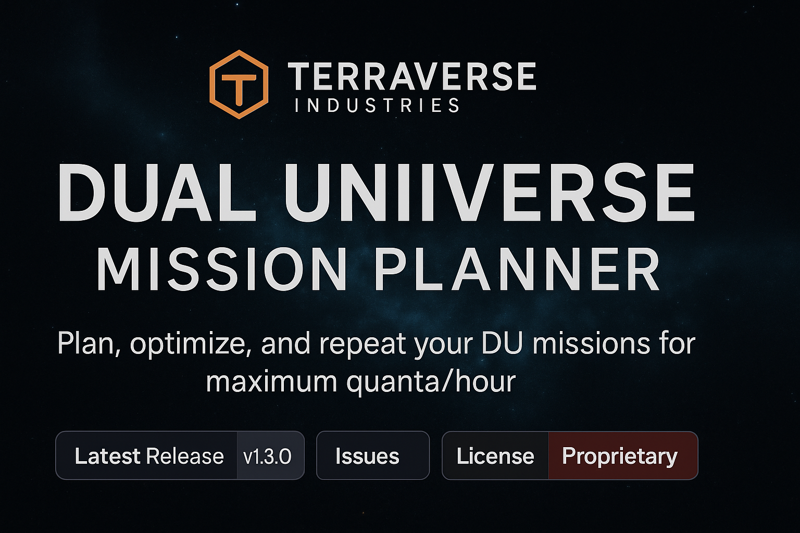

   
    
  <b>Dual Universe Mission Planner</b> 
  <i>Plan, optimize, and repeat your DU missions for maximum quanta/hour</i>

  
  
  

---

# Dual Universe Mission Planner

A lightweight, browser‑based route planner for **Dual Universe** mission running. Plan profitable routes, compare **full-route vs repeating loops**, and visualize pickups/returns with live capacity checks.

> Developed by **R55BNN @ TerraVerse Industries**

## ✨ Features
- **Start planet hard‑lock** — first leg always begins at your selected start (deadhead added if needed).
- **Repeat loop auto‑selection** — if a repeating cycle yields higher **q/hr**, it’s chosen automatically.
- **3‑cycle preview** when no time budget, or **time‑filling** loops when a budget is set.
- **Capacity awareness** — legs that exceed your entered ship volume are highlighted.
- Offline, client‑only: just open `index.html`.

## 🚀 Quick Start
1. Clone or download this repository.
2. Open `index.html` in your browser.
3. Pick your **Starting** and **Ending** planets.
4. Select missions and click **Plan Route**.

## 🧠 How it decides
- Computes a **full-route** plan across selected missions.
- Computes best **repeating** cycle (single or reciprocal pair) and its steady‑state **quanta/hour**.
- Chooses whichever yields higher **q/hr**.
- Enforces your **Starting planet** after planning/expansion/budgeting to ensure the first leg is from your selection.
- Appends a **Return** leg to your Ending planet.

## ⚙️ Configuration
- **Ship Capacity (kL)**: used to warn about over‑volume legs.
- **Time Budget (h)**: limit planning horizon; the planner fills the window with repeat cycles if those win.
- **Theme**: toggle Light/Dark from the header.

## 🛠 Development
- No build system required. Single‑page app: `index.html`, `styles.css`, `app.js`.
- Mission data is currently **baked** into `app.js`.

## 📦 Hosting on GitHub Pages
1. Push this repo to GitHub.
2. In **Settings → Pages**, set **Source** to “Deploy from a branch”, choose your branch (e.g., `main`) and `/ (root)`.
3. Visit the Pages URL once it’s live and hard‑refresh (Ctrl/Cmd+Shift+R).

## 🧾 Changelog
See [CHANGELOG.md](./CHANGELOG.md).

## 🧑‍💻 Credits
- UI & logic by **R55BNN @ TerraVerse Industries**
